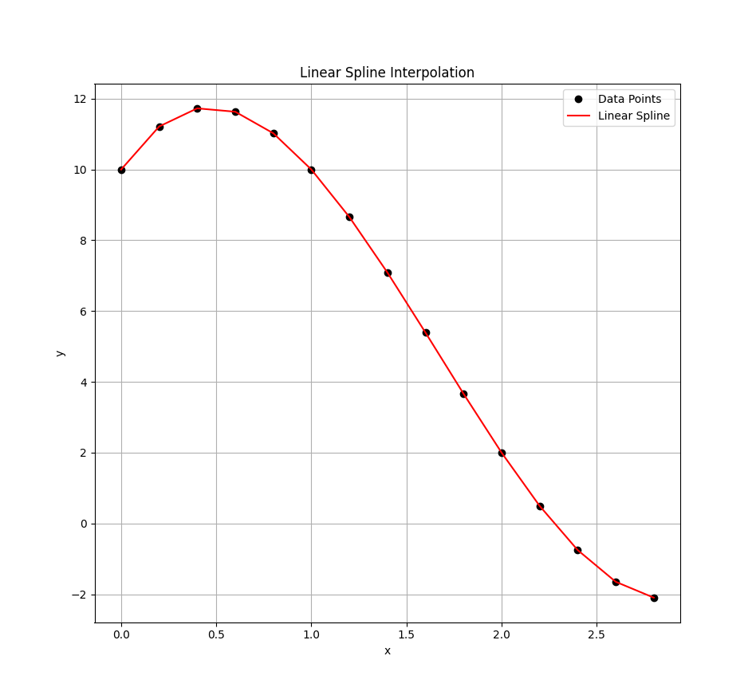
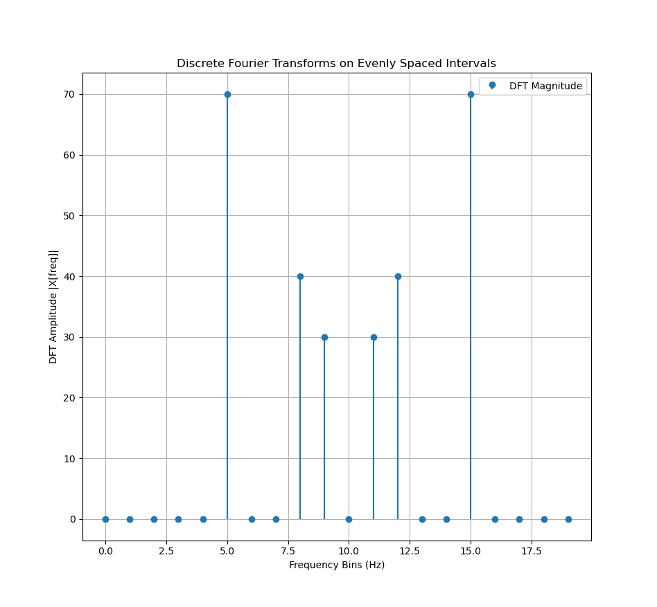

# Computational Methods

My implementation of various computational methods for numerical analysis from our CSC 225 course.

## Methods

### I. Root Finding

-   Bisection method
-   Newton-Raphson method
-   Secant method

### II. Numerical Differentiation

-   Forward Difference method
-   Backward Difference method
-   Center Difference method

### III. Numerical Integration

-   Trapezoidal Rule

### IV. Differential Equations

-   Euler's method
-   Improved Euler's method (Heun's)

### V. Interpolation

-   Linear Spline Interpolation (Lerp)
-   Quadratic Spline Interpolation
-   Cubic Spline Interpolation (Cerp)

### VI. Fourier Transforms

-   Discrete Fourier Transforms (DFT)
-   Fast Fourier Transform (FFT) - Cooley-Tukey

### VII. Linear Algebra

- LU Decomposition (Dolittle's)
- Gaussian Elimination
- Jacobi Method

## Sample Output from Euler's Method Computation

```
EULER'S METHOD APPROXIMATION OF SOLUTIONS TO ODEs

Problem: dy/dx = y
Initial condition: y(0) = 1
--------------------------------------------------------
n   | xn       | yn       | dy/dx    | h        | yn+1
--------------------------------------------------------
0   | 0.0000   | 1.0000   | 1.0000   | 0.1000   | 1.1000
1   | 0.1000   | 1.1000   | 1.1000   | 0.1000   | 1.2100
2   | 0.2000   | 1.2100   | 1.2100   | 0.1000   | 1.3310
3   | 0.3000   | 1.3310   | 1.3310   | 0.1000   | 1.4641
4   | 0.4000   | 1.4641   | 1.4641   | 0.1000   | 1.6105
5   | 0.5000   | 1.6105   | 1.6105   | 0.1000   | 1.7716
6   | 0.6000   | 1.7716   | 1.7716   | 0.1000   | 1.9487
7   | 0.7000   | 1.9487   | 1.9487   | 0.1000   | 2.1436
8   | 0.8000   | 2.1436   | 2.1436   | 0.1000   | 2.3579
9   | 0.9000   | 2.3579   | 2.3579   | 0.1000   | 2.5937
10  | 1.0000   | 2.5937   | 2.5937   | 0.1000   | 2.8531
11  | 1.1000   | 2.8531   | 2.8531   | 0.1000   | 3.1384
12  | 1.2000   | 3.1384   | 3.1384   | 0.1000   | 3.4523
13  | 1.3000   | 3.4523   | 3.4523   | 0.1000   | 3.7975
14  | 1.4000   | 3.7975   | 3.7975   | 0.1000   | 4.1772
15  | 1.5000   | 4.1772   | 4.1772   | 0.1000   | 4.5950
16  | 1.6000   | 4.5950   | 4.5950   | 0.1000   | 5.0545
17  | 1.7000   | 5.0545   | 5.0545   | 0.1000   | 5.5599
18  | 1.8000   | 5.5599   | 5.5599   | 0.1000   | 6.1159
19  | 1.9000   | 6.1159   | 6.1159   | 0.1000   | 6.7275


Problem: dy/dx = x
Initial condition: y(0) = 0
--------------------------------------------------------
n   | xn       | yn       | dy/dx    | h        | yn+1
--------------------------------------------------------
0   | 0.0000   | 0.0000   | 0.0000   | 0.1000   | 0.0000
1   | 0.1000   | 0.0000   | 0.1000   | 0.1000   | 0.0100
2   | 0.2000   | 0.0100   | 0.2000   | 0.1000   | 0.0300
3   | 0.3000   | 0.0300   | 0.3000   | 0.1000   | 0.0600
4   | 0.4000   | 0.0600   | 0.4000   | 0.1000   | 0.1000
5   | 0.5000   | 0.1000   | 0.5000   | 0.1000   | 0.1500
6   | 0.6000   | 0.1500   | 0.6000   | 0.1000   | 0.2100
7   | 0.7000   | 0.2100   | 0.7000   | 0.1000   | 0.2800
8   | 0.8000   | 0.2800   | 0.8000   | 0.1000   | 0.3600
9   | 0.9000   | 0.3600   | 0.9000   | 0.1000   | 0.4500
10  | 1.0000   | 0.4500   | 1.0000   | 0.1000   | 0.5500
11  | 1.1000   | 0.5500   | 1.1000   | 0.1000   | 0.6600
12  | 1.2000   | 0.6600   | 1.2000   | 0.1000   | 0.7800
13  | 1.3000   | 0.7800   | 1.3000   | 0.1000   | 0.9100
14  | 1.4000   | 0.9100   | 1.4000   | 0.1000   | 1.0500
15  | 1.5000   | 1.0500   | 1.5000   | 0.1000   | 1.2000
16  | 1.6000   | 1.2000   | 1.6000   | 0.1000   | 1.3600
17  | 1.7000   | 1.3600   | 1.7000   | 0.1000   | 1.5300
18  | 1.8000   | 1.5300   | 1.8000   | 0.1000   | 1.7100
19  | 1.9000   | 1.7100   | 1.9000   | 0.1000   | 1.9000


Problem: dy/dx = sin(x)
Initial condition: y(0) = 1
--------------------------------------------------------
n   | xn       | yn       | dy/dx    | h        | yn+1
--------------------------------------------------------
0   | 0.0000   | 1.0000   | 0.0000   | 0.1000   | 1.0000
1   | 0.1000   | 1.0000   | 0.0998   | 0.1000   | 1.0100
2   | 0.2000   | 1.0100   | 0.1987   | 0.1000   | 1.0299
3   | 0.3000   | 1.0299   | 0.2955   | 0.1000   | 1.0594
4   | 0.4000   | 1.0594   | 0.3894   | 0.1000   | 1.0983
5   | 0.5000   | 1.0983   | 0.4794   | 0.1000   | 1.1463
6   | 0.6000   | 1.1463   | 0.5646   | 0.1000   | 1.2028
7   | 0.7000   | 1.2028   | 0.6442   | 0.1000   | 1.2672
8   | 0.8000   | 1.2672   | 0.7174   | 0.1000   | 1.3389
9   | 0.9000   | 1.3389   | 0.7833   | 0.1000   | 1.4172
10  | 1.0000   | 1.4172   | 0.8415   | 0.1000   | 1.5014
11  | 1.1000   | 1.5014   | 0.8912   | 0.1000   | 1.5905
12  | 1.2000   | 1.5905   | 0.9320   | 0.1000   | 1.6837
13  | 1.3000   | 1.6837   | 0.9636   | 0.1000   | 1.7801
14  | 1.4000   | 1.7801   | 0.9854   | 0.1000   | 1.8786
15  | 1.5000   | 1.8786   | 0.9975   | 0.1000   | 1.9784
16  | 1.6000   | 1.9784   | 0.9996   | 0.1000   | 2.0783
17  | 1.7000   | 2.0783   | 0.9917   | 0.1000   | 2.1775
18  | 1.8000   | 2.1775   | 0.9738   | 0.1000   | 2.2749
19  | 1.9000   | 2.2749   | 0.9463   | 0.1000   | 2.3695
```

### Sample Lerp Output

```
LINEAR INTERPOLATION (LERP) VIA LINEAR SPLINES
----------------------------------------------
x: [0.0, 0.2, 0.4, 0.6, 0.8, 1.0, 1.2, 1.4, 1.6, 1.8, 2.0, 2.2, 2.4, 2.6, 2.8]
y: [10.0, 11.216, 11.728, 11.632, 11.024, 10.0, 8.656, 7.088, 5.392, 3.664, 2.0, 0.496, -0.752, -1.648, -2.096]
X: [0.0, 0.2, 0.4, 0.6, 0.8, 1.0, 1.2, 1.4, 1.6, 1.8, 2.0, 2.2, 2.4, 2.6, 2.8]
Y: [10.0, 11.216, 11.728, 11.632, 11.024, 10.0, 8.656, 7.088, 5.392, 3.664, 2.0, 0.496, -0.752, -1.648, -2.096]
```



### Sample DFT Output

```
DISCRETE FOURIER TRANSFORM (DFT) ON EVENLY SPACED SAMPLED SIGNALS
------------------------------------------------------------------
Sampling Rate: 20Hz per second
Sampled Time: [0.0, 0.05, 0.1, 0.15, 0.2, 0.25, 0.3, 0.35, 0.4, 0.45, 0.5, 0.55, 0.6, 0.65, 0.7, 0.75, 0.8, 0.85, 0.9, 0.95]
Sampled Signals: [0.0, 5.57590997, 2.04087031, -8.37717508, -0.50202854, 10.0, -5.20431056, -0.768722952, -5.56758182, 10.278192, 1.71450552e-15, -10.278192, 5.56758182, 0.768722952, 5.20431056, -10.0, 0.50202854, 8.37717508, -2.04087031, -5.57590997]
Frequencies: [0.0, 1.0, 2.0, 3.0, 4.0, 5.0, 6.0, 7.0, 8.0, 9.0, 10.0, 11.0, 12.0, 13.0, 14.0, 15.0, 16.0, 17.0, 18.0, 19.0]
Magnitudes: [8.881784197001252e-16, 5.324005902807683e-09, 7.95147192533863e-09, 1.6912485634179598e-08, 2.8537386675967933e-08, 70.00000000399999, 2.1372325242942584e-08, 2.612710048506525e-09, 40.00000001048071, 30.000000004975725, 2.2942475566164232e-14, 30.00000000497574, 40.00000001048064, 2.612764227198249e-09, 2.1372252412524513e-08, 70.00000000400001, 2.8537468388468907e-08, 1.6912498068739307e-08, 7.951387104343746e-09, 5.3240201140351945e-09]
```


